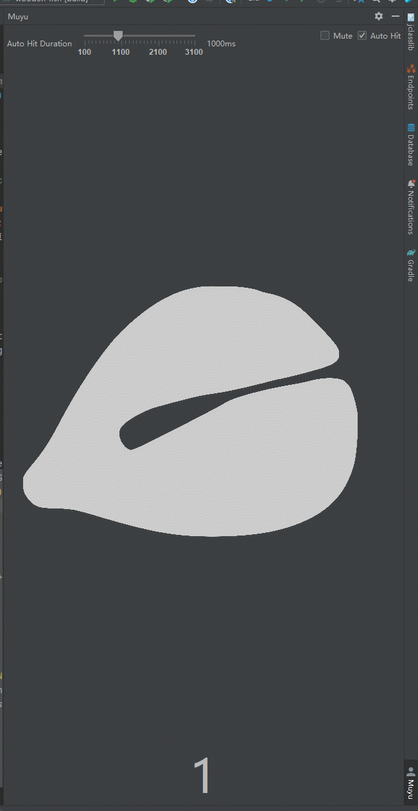

# Muyu

Muyu is an electronic wooden fish that calms you down while you're developing.

## Screenshots

## Usage

1. Click the wooden fish and calm you down.
2. Select the `Auto Hit' and enjoy the ticktock.

## License
The software is licensed under the [Apache-2.0 License](LICENSE).
